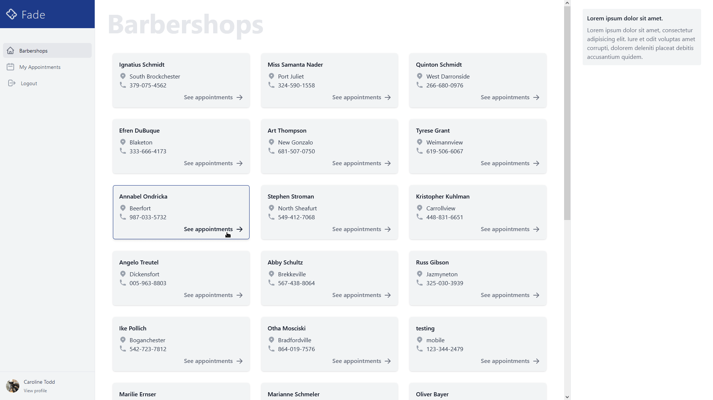

# Fade

Fade is a fullstack web application that barbers can use to post and manage their appointments and their customers can book them.

## Inspiration

The barber I currently go takes phone calls to book their appointment. I made this app to save the barber time by not having to answer calls and keep a log on paper, and saving time for the customer which instead of calling the barber which can take a couple of minutes, they can use this application and book their appointment with a single click in seconds.

**Link to project:** https://fadeapp.herokuapp.com/

## Demo Accounts

password is **12345678** for all of the accounts below

- `carolinetodd@example.com` (customer account)
- `fran@example.com` (barber account)
- `bev@example.com` (admin account)

## How It's Made:

**Tech used:** Javascript, Node.js, Express, Mongoose, MongoDB, JsonWebTokens, React, Tailwind, Cloudinary

The backend is a server done in Node.js, Express built using the MVC pattern that talks with a MongoDB database using mongoose and handle image upload using Multer to Cloudinary. Authentication is handled using JsonWebTokens.

The frontend is a React Single Page Application that provides the user with a dynamic interface. The styling is done using Tailwindcss. The state management is done using React's Context API.

## Lessons Learned:

While creating this application I learned about data modeling, database querying, authentication using JsonWebToken, state management using React's Context API and how to keep the two parts in sync.
